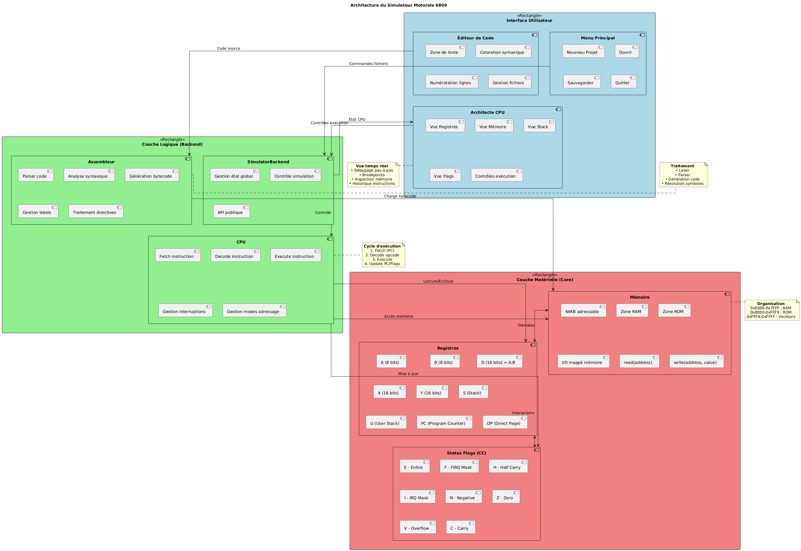
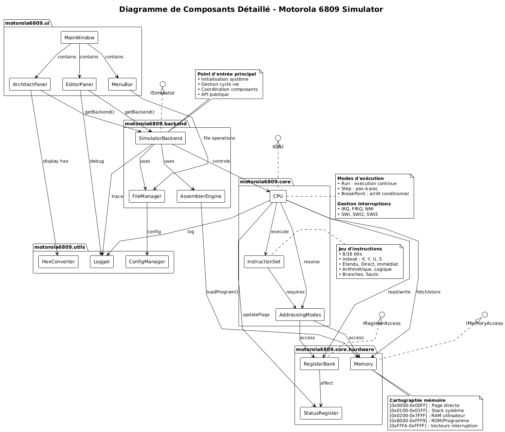
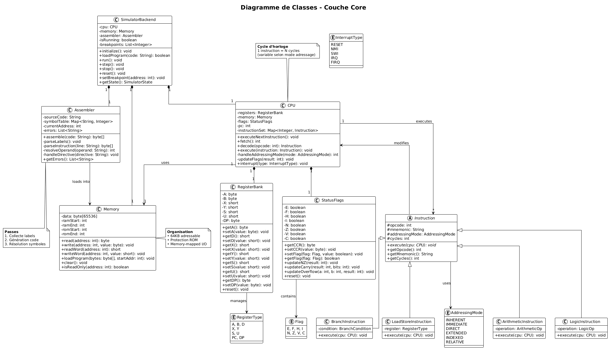

# Simulateur Motorola 6809 - Documentation Complète
---
## Remerciement 

Nous adressons nos remerciements les plus sincères au **Pr. Dr. Hicham BENALLA** pour son encadrement et son soutien essentiel dans le cadre de notre projet de développement d'un simulateur pour le microprocesseur Motorola 6809.

Ses connaissances approfondies et ses retours constructifs nous ont été d'une aide inestimable. Nous sommes très reconnaissants pour le temps qu'il nous a consacré et pour la qualité de son accompagnement pédagogique.

---

## Table des Matières
1. [Aperçu du Projet](#aperçu-du-projet)
2. [Architecture Technique](#architecture-technique)
3. [Instructions Implémentées](#instructions-implémentées)
4. [Modes d'Adressage](#modes-dadressage)
5. [Structure des Fichiers](#structure-des-fichiers)
6. [Guide d'Utilisation](#guide-dutilisation)
7. [Technologies Utilisées](#technologies-utilisées)
8. [Compilation et Exécution](#compilation-et-exécution)
9. [Tests et Validation](#tests-et-validation)
10. [Dépannage](#dépannage)

---

## Aperçu du Projet

### Objectif
Un simulateur complet du microprocesseur Motorola 6809 avec interface graphique JavaFX, assembleur intégré et débogueur.

### Fonctionnalités Principales
- Émulation complète du CPU 6809
- Assembleur intégré avec support des directives
- Interface graphique avec éditeur de code
- Affichage en temps réel des registres et flags
- Débogueur avec support des points d'arrêt
- Exécution pas à pas
- Affichage mémoire hexadécimal

---

## Architecture Technique

### Diagramme d'Architecture

<p align="center">
  
</p>

<details>
<summary>Diagramme texte (cliquer pour développer)</summary>

```
┌─────────────────────────────────────────────────┐
│           INTERFACE UTILISATEUR                 │
│  ┌─────────┐ ┌─────────┐ ┌──────────────────┐   │
│  │ Éditeur │ │Architect│ │   Menu Principal │   │
│  └─────────┘ └─────────┘ └──────────────────┘   │
└─────────────────────────────────────────────────┘
                        │
┌─────────────────────────────────────────────────┐
│             COUCHE LOGIQUE (Backend)            │
│  ┌─────────┐ ┌─────────┐ ┌──────────────────┐   │
│  │   CPU   │ │Assembler│ │SimulatorBackend  │   │
│  └─────────┘ └─────────┘ └──────────────────┘   │
└─────────────────────────────────────────────────┘
                        │
┌─────────────────────────────────────────────────┐
│           COUCHE MATÉRIELLE (Core)              │
│  ┌─────────┐ ┌─────────┐ ┌──────────────────┐   │
│  │Registres│ │ Mémoire │ │  Status Flags    │   │
│  └─────────┘ └─────────┘ └──────────────────┘   │
└─────────────────────────────────────────────────┘
```
</details>

### Diagramme de Composants

<p align="center">
  
</p>

### Composants Principaux

#### 1. Core (`motorola6809.core`)
- `CPU.java` : Cœur du processeur, exécute les instructions
- `Register.java` : Gestion des registres (A, B, X, Y, S, U, PC, DP)
- `Memory.java` : Mémoire 64KB avec zones RAM/ROM
- `StatusFlags.java` : Registre de condition (CC)
- `SimulatorBackend.java` : Point d'entrée principal, gestion de l'état

#### 2. Instructions (`motorola6809.instruction`)
- `Instruction.java` : Classe abstraite pour toutes les instructions
- `InstructionSet.java` : Registre de toutes les instructions
- `InstructionDecoder.java` : Décode et exécute les opcodes
- Package `impl/` : Implémentations concrètes des instructions

#### 3. Assembleur (`motorola6809.assembler`)
- `Assembler.java` : Assembleur deux passes
- `Parser.java` : Analyse syntaxique du code assembleur
- `OpcodeGenerator.java` : Table des opcodes
- `SymbolTable.java` : Gestion des étiquettes et constantes

#### 4. Interface (`motorola6809.ui`)
- `MainApp.java` : Point d'entrée JavaFX
- `MenuWindow.java` : Fenêtre principale
- `EditeurWindow.java` : Éditeur de code assembleur
- `ArchitectureWindow.java` : Vue des registres et flags

#### 5. Utilitaires (`motorola6809.utils`)
- `BitOperations.java` : Manipulations de bits
- `HexConverter.java` : Conversions hexadécimales
- `ValidationUtils.java` : Validation des données

---

## Instructions Implémentées

Ce simulateur implémente 76 instructions du jeu d'instructions Motorola 6809, organisées par catégorie fonctionnelle. Chaque instruction supporte plusieurs modes d'adressage comme indiqué par les variantes d'opcode.

### Catégories d'Instructions

| Catégorie | Nombre | Description |
|----------|--------|-------------|
| Transfert de Données | 10 | Opérations de chargement et stockage |
| Arithmétique | 9 | Addition, soustraction, multiplication |
| Logique | 10 | Opérations bit à bit |
| Incrémentation/Décrémentation | 6 | Opérations d'incrémentation et décrémentation |
| Branchements | 16 | Branchements conditionnels et inconditionnels |
| Contrôle de Flux | 5 | Sauts et gestion des sous-routines |
| Pile | 6 | Manipulation de la pile |
| Divers | 14 | Opérations sur registres et contrôle |

---

### Instructions de Transfert de Données

#### Opérations de Chargement
| Mnémonique | Description | Immédiat | Direct | Étendu | Indexé |
|----------|-------------|----------|--------|--------|--------|
| **LDA** | Charger l'accumulateur A | 0x86 | 0x96 | 0xB6 | 0xA6 |
| **LDB** | Charger l'accumulateur B | 0xC6 | 0xD6 | 0xF6 | 0xE6 |
| **LDD** | Charger le double accumulateur (A:B) | 0xCC | 0xDC | 0xFC | 0xEC |
| **LDX** | Charger le registre d'index X | 0x8E | 0x9E | 0xBE | 0xAE |
| **LDU** | Charger le pointeur de pile utilisateur | 0xCE | 0xDE | 0xFE | 0xEE |

#### Opérations de Stockage
| Mnémonique | Description | Direct | Étendu | Indexé |
|----------|-------------|--------|--------|--------|
| **STA** | Stocker l'accumulateur A | 0x97 | 0xB7 | 0xA7 |
| **STB** | Stocker l'accumulateur B | 0xD7 | 0xF7 | 0xE7 |
| **STD** | Stocker le double accumulateur | 0xDD | 0xFD | 0xED |
| **STX** | Stocker le registre d'index X | 0x9F | 0xBF | 0xAF |
| **STU** | Stocker le pointeur de pile utilisateur | 0xDF | 0xFF | 0xEF |

---

### Instructions Arithmétiques

| Mnémonique | Opération | Description | Opcodes |
|----------|-----------|-------------|---------|
| **ADDA** | A + M → A | Additionner mémoire à A | 0x8B (imm), 0x9B (dir), 0xBB (ext), 0xAB (idx) |
| **ADDB** | B + M → B | Additionner mémoire à B | 0xCB (imm), 0xDB (dir), 0xFB (ext), 0xEB (idx) |
| **ADDD** | D + M → D | Additionner mémoire à D | 0xC3 (imm), 0xD3 (dir), 0xF3 (ext), 0xE3 (idx) |
| **SUBA** | A - M → A | Soustraire mémoire de A | 0x80 (imm), 0x90 (dir), 0xB0 (ext), 0xA0 (idx) |
| **SUBB** | B - M → B | Soustraire mémoire de B | 0xC0 (imm), 0xD0 (dir), 0xF0 (ext), 0xE0 (idx) |
| **SUBD** | D - M → D | Soustraire mémoire de D | 0x83 (imm), 0x93 (dir), 0xB3 (ext), 0xA3 (idx) |
| **MUL** | A × B → D | Multiplication non signée | 0x3D |
| **DAA** | Ajustement décimal A | Correction BCD après addition | 0x19 |
| **ABA** | A + B → A | Additionner B à A | 0x1B |

---

### Instructions Logiques

| Mnémonique | Opération | Description | Opcodes |
|----------|-----------|-------------|---------|
| **ANDA** | A ∧ M → A | ET logique avec A | 0x84 (imm), 0x94 (dir), 0xB4 (ext), 0xA4 (idx) |
| **ANDB** | B ∧ M → B | ET logique avec B | 0xC4 (imm), 0xD4 (dir), 0xF4 (ext), 0xE4 (idx) |
| **ORA** | A ∨ M → A | OU logique avec A | 0x8A (imm), 0x9A (dir), 0xBA (ext), 0xAA (idx) |
| **ORB** | B ∨ M → B | OU logique avec B | 0xCA (imm), 0xDA (dir), 0xFA (ext), 0xEA (idx) |
| **EORA** | A ⊕ M → A | OU exclusif avec A | 0x88 (imm), 0x98 (dir), 0xB8 (ext), 0xA8 (idx) |
| **EORB** | B ⊕ M → B | OU exclusif avec B | 0xC8 (imm), 0xD8 (dir), 0xF8 (ext), 0xE8 (idx) |
| **COMA** | ¬A → A | Complément à un de A | 0x43 |
| **COMB** | ¬B → B | Complément à un de B | 0x53 |
| **NEGA** | -A → A | Complément à deux de A | 0x40 |
| **NEGB** | -B → B | Complément à deux de B | 0x50 |

---

### Instructions d'Incrémentation et Décrémentation

| Mnémonique | Opération | Description | Opcodes |
|----------|-----------|-------------|---------|
| **INCA** | A + 1 → A | Incrémenter l'accumulateur A | 0x4C |
| **INCB** | B + 1 → B | Incrémenter l'accumulateur B | 0x5C |
| **DECA** | A - 1 → A | Décrémenter l'accumulateur A | 0x4A |
| **DECB** | B - 1 → B | Décrémenter l'accumulateur B | 0x5A |
| **INC** | M + 1 → M | Incrémenter l'emplacement mémoire | 0x0C (dir), 0x7C (ext), 0x6C (idx) |
| **DEC** | M - 1 → M | Décrémenter l'emplacement mémoire | 0x0A (dir), 0x7A (ext), 0x6A (idx) |

---

### Instructions de Branchement

#### Branchements Inconditionnels
| Mnémonique | Condition | Description | Opcode |
|----------|-----------|-------------|--------|
| **BRA** | Toujours | Branchement toujours | 0x20 |
| **BRN** | Jamais | Branchement jamais (NOP avec offset) | 0x21 |

#### Branchements Conditionnels Signés
| Mnémonique | Condition | Flags | Description | Opcode |
|----------|-----------|-------|-------------|--------|
| **BEQ** | Z = 1 | Égal | Brancher si égal à zéro | 0x27 |
| **BNE** | Z = 0 | Différent | Brancher si différent de zéro | 0x26 |
| **BMI** | N = 1 | Négatif | Brancher si négatif | 0x2B |
| **BPL** | N = 0 | Positif | Brancher si positif ou zéro | 0x2A |
| **BVS** | V = 1 | Débordement | Brancher si débordement | 0x29 |
| **BVC** | V = 0 | Pas de débordement | Brancher si pas de débordement | 0x28 |
| **BGT** | Z=0 ∧ N=V | Plus grand | Brancher si plus grand que | 0x2E |
| **BGE** | N = V | Plus grand ou égal | Brancher si plus grand ou égal | 0x2C |
| **BLT** | N ≠ V | Plus petit | Brancher si plus petit que | 0x2D |
| **BLE** | Z=1 ∨ N≠V | Plus petit ou égal | Brancher si plus petit ou égal | 0x2F |

#### Branchements Conditionnels Non Signés
| Mnémonique | Condition | Flags | Description | Opcode |
|----------|-----------|-------|-------------|--------|
| **BHI** | C=0 ∧ Z=0 | Supérieur | Brancher si supérieur | 0x22 |
| **BHS/BCC** | C = 0 | Supérieur ou égal | Brancher si retenue effacée | 0x24 |
| **BLS** | C=1 ∨ Z=1 | Inférieur ou égal | Brancher si inférieur ou égal | 0x23 |
| **BLO/BCS** | C = 1 | Inférieur | Brancher si retenue positionnée | 0x25 |

---

### Instructions de Contrôle de Flux

| Mnémonique | Description | Opération | Opcodes |
|----------|-------------|-----------|---------|
| **JMP** | Saut | PC ← EA | 0x0E (dir), 0x7E (ext), 0x6E (idx) |
| **JSR** | Saut vers sous-routine | Empiler PC, PC ← EA | 0x9D (dir), 0xBD (ext), 0xAD (idx) |
| **BSR** | Branchement vers sous-routine | Empiler PC, PC ← PC + offset | 0x8D |
| **RTS** | Retour de sous-routine | Dépiler PC de la pile | 0x39 |
| **RTI** | Retour d'interruption | Dépiler registres de la pile | 0x3B |

---

### Instructions de Pile

| Mnémonique | Description | Opération | Opcode |
|----------|-------------|-----------|--------|
| **PSHS** | Empiler sur pile système | S ← S-n, empiler registres | 0x34 |
| **PULS** | Dépiler de pile système | Dépiler registres, S ← S+n | 0x35 |
| **PSHU** | Empiler sur pile utilisateur | U ← U-n, empiler registres | 0x36 |
| **PULU** | Dépiler de pile utilisateur | Dépiler registres, U ← U+n | 0x37 |
| **LEAS** | Charger adresse effective dans S | S ← EA | 0x32 |
| **LEAU** | Charger adresse effective dans U | U ← EA | 0x33 |

---

### Instructions Diverses

#### Opérations sur Registres
| Mnémonique | Description | Opération | Opcode |
|----------|-------------|-----------|--------|
| **TFR** | Transférer registre vers registre | R1 → R2 | 0x1F |
| **EXG** | Échanger registres | R1 ↔ R2 | 0x1E |
| **SEX** | Extension de signe | Étendre le signe de B vers A | 0x1D |
| **ABX** | Ajouter B à X | X ← X + B | 0x3A |

#### Opérations de Test et Effacement
| Mnémonique | Description | Opération | Opcode |
|----------|-------------|-----------|--------|
| **TSTA** | Tester l'accumulateur A | A - 0, mise à jour flags | 0x4D |
| **TSTB** | Tester l'accumulateur B | B - 0, mise à jour flags | 0x5D |
| **CLRA** | Effacer l'accumulateur A | 0 → A | 0x4F |
| **CLRB** | Effacer l'accumulateur B | 0 → B | 0x5F |

#### Contrôle Système
| Mnémonique | Description | Opération | Opcode |
|----------|-------------|-----------|--------|
| **NOP** | Aucune opération | PC ← PC + 1 | 0x12 |
| **SYNC** | Synchroniser avec interruption | Attendre interruption | 0x13 |
| **SWI** | Interruption logicielle | Déclencher interruption | 0x3F |
| **CWAI** | Effacer CC et attendre | CC ∧ immédiat, attendre | 0x3C |

---

### Statistiques d'Implémentation

```
Total Instructions Implémentées : 76
├── Transfert de Données :        10 (13,2%)
├── Arithmétique :                  9 (11,8%)
├── Logique :                      10 (13,2%)
├── Incrémentation/Décrémentation : 6 (7,9%)
├── Branchements :                 16 (21,1%)
├── Contrôle de Flux :              5 (6,6%)
├── Pile :                          6 (7,9%)
└── Divers :                       14 (18,4%)
```

### Légende des Modes d'Adressage
- **imm** = Immédiat (#valeur)
- **dir** = Direct ($XX)
- **ext** = Étendu ($XXXX)
- **idx** = Indexé (,X ou offset,X)

### Effets sur les Flags
Toutes les instructions mettent à jour correctement les flags du registre de condition (CC) :
- **E** = État complet sauvegardé
- **F** = Masque d'interruption FIRQ
- **H** = Demi-retenue
- **I** = Masque d'interruption IRQ
- **N** = Résultat négatif
- **Z** = Résultat zéro
- **V** = Débordement
- **C** = Retenue/Emprunt

---

## Modes d'Adressage

### 1. Mode Immédiat (#)
```asm
LDA #$05     ; Charger 0x05 dans A
LDD #$1234   ; Charger 0x1234 dans D
```
- **Format** : `#valeur`
- **Taille** : 1 ou 2 octets selon l'instruction
- **Cycles** : +0 cycles

### 2. Mode Direct ($xx)
```asm
LDA $10      ; Charger depuis (DP:$10)
STA $20      ; Stocker à (DP:$20)
```
- **Format** : `$offset` (8 bits)
- **Adresse** : (DP << 8) | offset
- **Taille** : 1 octet
- **Cycles** : +1 cycle

### 3. Mode Étendu ($xxxx)
```asm
LDA $1000    ; Charger depuis 0x1000
JMP $2000    ; Sauter à 0x2000
```
- **Format** : `$adresse` (16 bits)
- **Adresse** : adresse complète
- **Taille** : 2 octets
- **Cycles** : +2 cycles

### 4. Mode Indexé
```asm
LDA ,X       ; Charger depuis [X]
LDA 5,X      ; Charger depuis [X+5]
LDA -10,X    ; Charger depuis [X-10]
LDA A,X      ; Charger depuis [X+A]
LDA D,X      ; Charger depuis [X+D]
LDA ,X+      ; Charger depuis [X] puis X++
LDA ,-X      ; Décrémenter X puis charger
LDA [,X]     ; Indirect via X
```
- **Formats complexes** :
  - `,X` `,Y` `,U` `,S`
  - `offset,X`
  - `accumulateur,X` (A, B, D)
  - `,X+` `,X++` `,-X` `,--X`
  - `[adresse]` (indirect)
- **Cycles** : 1-4 cycles supplémentaires

### 5. Mode Relatif (Branchements)
```asm
BRA LABEL    ; Sauter à LABEL
BNE LOOP     ; Sauter si Z=0
```
- **Format** : étiquette
- **Offset** : 8 bits (-128 à +127) ou 16 bits
- **Taille** : 1 ou 2 octets
- **Cycles** : +0 (non pris) ou +1 (pris)

### 6. Mode Inhérent
```asm
INCA         ; Incrémenter A
MUL          ; Multiplier A×B
NOP          ; Aucune opération
```
- **Format** : pas d'opérande
- **Taille** : 0 octet
- **Cycles** : cycles de base seulement

### 7. Mode Registre (TFR/EXG)
```asm
TFR A,B      ; Transférer A → B
EXG X,Y      ; Échanger X ↔ Y
```
- **Format** : `registre1,registre2`
- **Postbyte** : spécifie les registres
- **Taille** : 1 octet (postbyte)
- **Cycles** : 6 (TFR) ou 8 (EXG)

---

## Structure des Fichiers

```
simulator/
├── src/main/java/motorola6809/
│   ├── core/                    # Cœur du simulateur
│   │   ├── CPU.java            # Processeur principal
│   │   ├── Register.java       # Registres
│   │   ├── Memory.java         # Mémoire 64KB
│   │   ├── StatusFlags.java    # Flags de condition
│   │   └── SimulatorBackend.java # Backend principal
│   │
│   ├── instruction/            # Système d'instructions
│   │   ├── Instruction.java    # Classe abstraite
│   │   ├── InstructionSet.java # Registre d'instructions
│   │   ├── InstructionDecoder.java # Décodeur
│   │   └── impl/               # Implémentations
│   │       ├── LDA.java        # Charger A
│   │       ├── BNE.java        # Brancher si différent
│   │       ├── BEQ.java        # Brancher si égal
│   │       └── ... (76 fichiers)
│   │
│   ├── addressing/             # Modes d'adressage
│   │   ├── AddressingMode.java # Classe abstraite
│   │   ├── AddressingModeResolver.java
│   │   └── modes/
│   │       ├── ImmediateMode.java
│   │       ├── DirectMode.java
│   │       ├── ExtendedMode.java
│   │       ├── IndexedMode.java
│   │       ├── InherentMode.java
│   │       └── RelativeMode.java
│   │
│   ├── assembler/              # Assembleur intégré
│   │   ├── Assembler.java      # Assembleur 2 passes
│   │   ├── Parser.java         # Analyseur syntaxique
│   │   ├── OpcodeGenerator.java # Table d'opcodes
│   │   ├── SymbolTable.java    # Table des symboles
│   │   └── AssemblerException.java
│   │
│   ├── ui/                     # Interface utilisateur
│   │   ├── MainApp.java        # Application principale
│   │   ├── MenuWindow.java     # Fenêtre principale
│   │   ├── EditeurWindow.java  # Éditeur de code
│   │   ├── ArchitectureWindow.java # Vue architecture
│   │   └── DebugWindow.java    # Débogueur
│   │
│   ├── config/                 # Configuration
│   │   ├── Constants.java      # Constantes
│   │   ├── MemoryMap.java      # Carte mémoire
│   │   └── Configuration.java  # Configuration
│   │
│   ├── io/                     # Entrées/Sorties
│   │   ├── IOManager.java      # Gestionnaire E/S
│   │   ├── InputDevice.java    # Interface entrée
│   │   ├── OutputDevice.java   # Interface sortie
│   │   └── InterruptController.java
│   │
│   └── utils/                  # Utilitaires
│       ├── BitOperations.java  # Manipulation de bits
│       ├── HexConverter.java   # Conversion hexadécimale
│       └── ValidationUtils.java
│
├── src/test/java/motorola6809/test/
│   ├── TestInterface.java      # Tests d'interface
│   └── TestFinal.java          # Tests finaux
│
├── pom.xml                     # Configuration Maven
└── README.md                   # Cette documentation
```

## Diagramme de Classes Core

<p align="center">
  
</p>

---

## Guide d'Utilisation

### 1. Lancement de l'Application
```bash
# Avec Maven
mvn clean javafx:run

# Directement
java -jar target/simulator-1.0-SNAPSHOT.jar
```

### 2. Édition de Code
1. Ouvrez l'Éditeur depuis le Menu Principal
2. Tapez votre code assembleur :
```asm
        ORG $1000      ; Adresse de départ
START   LDA #$05       ; Charger 5 dans A
        LDB #$03       ; Charger 3 dans B
        MUL            ; Multiplier (A×B → D)
        STD $2000      ; Stocker le résultat
        SWI            ; Retour au système
        END            ; Fin
```

### 3. Assemblage
- Cliquez sur "Assembler" dans l'éditeur
- Vérifiez les messages dans la console
- Le code machine est chargé en mémoire à l'adresse spécifiée

### 4. Exécution
- **Démarrer** : Exécution continue
- **Pause** : Mettre en pause l'exécution
- **Pas à pas** : Exécuter instruction par instruction
- **Arrêter** : Arrêter l'exécution
- **Réinitialiser** : Remettre à l'état initial

### 5. Débogage
1. Ouvrez la **Vue Architecture** pour voir les registres
2. Utilisez les **Points d'arrêt** :
   - Ajoutez des points d'arrêt avec le débogueur
   - L'exécution s'arrête aux adresses spécifiées
3. **Exécution pas à pas** :
   - Observez les changements de registres
   - Suivez le flux d'exécution

### 6. Visualisation de la Mémoire
- Ouvrez "Vue Mémoire" depuis le menu
- Sélectionnez la zone RAM ou ROM
- Visualisez le contenu en hexadécimal et ASCII

---

## Technologies Utilisées

### Langages et Frameworks
- **Java 21** : Langage principal
- **JavaFX 21** : Interface graphique
- **Maven** : Gestion des dépendances et build

### Architecture
- **Modèle-Vue-Contrôleur (MVC)** : Séparation claire des responsabilités
- **Pattern Observer** : Communication backend-interface
- **Singleton** : SimulatorBackend, Configuration
- **Factory** : Création des modes d'adressage
- **Strategy** : Implémentation des instructions

### Concepts Informatiques Implémentés
- **Émulation CPU** : Cycle fetch-decode-execute
- **Assembleur 2 passes** : Résolution des symboles
- **Gestion mémoire** : 64KB avec zones RAM/ROM
- **Système de pile** : Piles système et utilisateur
- **Interruptions** : IRQ, FIRQ, NMI, SWI
- **Flags de condition** : 8 bits (E F H I N Z V C)

---

## Compilation et Exécution

### Prérequis
```bash
# Java 21 ou supérieur
java --version

# Maven 3.6 ou supérieur
mvn --version
```

### Compilation
```bash
# Compilation complète
mvn clean compile

# Créer le JAR exécutable
mvn clean package

# Exécuter les tests
mvn test
```

### Exécution
```bash
# Avec Maven (recommandé)
mvn javafx:run

# Avec le JAR généré
java -jar target/simulator-1.0-SNAPSHOT.jar

# Avec débogage
mvn javafx:run -Djavafx.debug=true -X
```

### Configuration Maven (pom.xml)
```xml
<properties>
    <project.build.sourceEncoding>UTF-8</project.build.sourceEncoding>
    <maven.compiler.source>21</maven.compiler.source>
    <maven.compiler.target>21</maven.compiler.target>
    <javafx.version>21.0.1</javafx.version>
</properties>

<dependencies>
    <dependency>
        <groupId>org.openjfx</groupId>
        <artifactId>javafx-controls</artifactId>
        <version>${javafx.version}</version>
    </dependency>
    <!-- Autres modules JavaFX -->
</dependencies>
```

---

## Tests et Validation

### Tests Unitaires
```java
// Exemple de test
public class TestCPU {
    @Test
    public void testLDAImmediate() {
        CPU cpu = new CPU();
        cpu.loadProgram(new byte[]{(byte)0x86, 0x05}, 0x1000);
        cpu.executeInstruction();
        assertEquals(0x05, cpu.getRegisters().getA());
    }
}
```

### Programmes de Test
```asm
; Test de multiplication
        ORG $1000
        LDA #$05
        LDB #$03
        MUL            ; D = 5×3 = 15 (0x000F)
        STD $2000
        SWI
        END

; Test de boucle avec BNE
        ORG $1000
        LDA #$0A       ; Compteur = 10
LOOP    DECA           ; Décrémenter
        BNE LOOP       ; Répéter 10 fois
        LDA #$FF       ; Fin
        SWI
        END
```

### Validation des Instructions
Chaque instruction est testée pour :
1. **Exactitude des résultats**
2. **Mise à jour correcte des flags**
3. **Nombre de cycles correct**
4. **Gestion des modes d'adressage**

---

## Dépannage

### Problèmes Courants

#### 1. "Instruction inconnue"
```bash
Erreur : Instruction inconnue : START
```
**Solution** : Vérifiez la syntaxe, START est une étiquette, pas une instruction.

#### 2. Boucle infinie
```bash
Avertissement : STU étendu à PC=$XXXX - Arrêt pour éviter boucle infinie
```
**Solution** : L'opcode 0xFF est traité deux fois, vérifiez InstructionDecoder.java.

#### 3. Interface qui ne se met pas à jour
**Solution** : Vérifiez que les observateurs sont correctement enregistrés et que Platform.runLater() est utilisé.

#### 4. Erreur d'assemblage
```bash
Mode d'adressage XXX non supporté pour YYY
```
**Solution** : Consultez la section [Modes d'Adressage](#modes-dadressage) pour la syntaxe correcte.

### Conseils de Débogage
```java
// Activer les logs détaillés
System.setProperty("DEBUG", "true");

// Ajouter des logs dans le code
System.out.println("PC: $" + String.format("%04X", cpu.getRegisters().getPC()));
System.out.println("Instruction: " + Integer.toHexString(opcode));
```

### Performance
- Limite d'instructions : 1000 par défaut (configurable)
- Mémoire : 64KB simulée
- Vitesse : Exécution en temps réel avec délai configurable

---

## Références

### Documentation Motorola 6809
- **Fiche technique officielle** : Motorola M6809 Microprocessor Programming Manual
- **Jeu d'instructions** : 59 instructions de base + préfixées
- **Architecture** : 8/16 bits, 2 accumulateurs, 2 index, 2 piles

### Standards
- **Adressage** : Big-endian (MSB en premier)
- **Mémoire** : Espace linéaire de 64KB
- **Pile** : Descendante (S/U décrémentent avant écriture)

### Outils Similaires
- **MAME** : Émulation arcade complète
- **MESS** : Émulation de systèmes avec 6809
- **XRoar** : Émulateur Dragon/CoCo

---

## Contribution

### Améliorations Possibles
1. **Support complet** des modes indexés complexes
2. **Émulation des périphériques** (ACIA, PIA, VDG)
3. **Chargement de fichiers** binaires et HEX
4. **Profileur d'exécution**
5. **Tests unitaires complets**

### Rapport de Bugs
1. Reproduire le problème avec un programme minimal
2. Noter l'adresse PC et l'opcode
3. Décrire l'état attendu vs. obtenu
4. Ouvrir une issue avec les logs

---

## Licence

Ce projet est fourni à des fins éducatives. Basé sur l'architecture Motorola 6809.

**Motorola 6809** est une marque déposée de Motorola, Inc. (maintenant NXP)

---

## Auteurs

**FARAJI SAFAA**  
**SALMA RADI**  
**IMANE BenBoucetta**  
**AYA MOUKRIM**

Simulateur développé dans le cadre d'un projet académique d'émulation de microprocesseur.

"Comprendre le passé pour construire l'avenir"

---

**Version** : 4.0  
**Dernière mise à jour** : 25 décembre 2025, 06h44  
**État** : Fonctionnel avec 76 instructions implémentées
